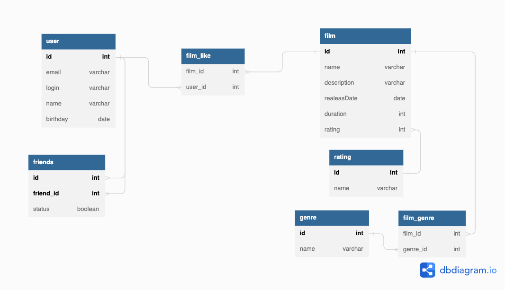

# java-filmorate

##Схема Базы данных

<picture>
  
</picture>

Информация о друзьях будет браться из таблицы friends по id пользователя.

Пример запроса:
SELECT * 
FROM friends
WHERE id = 1;

Данные о пользователе или его друге можно будет получить с помощью объединения таблиц friends и users

Информация о жанрах фильма будет извлекаться из таблицы film_genres по id фильма. Процесс аналогичен описанному выше.
